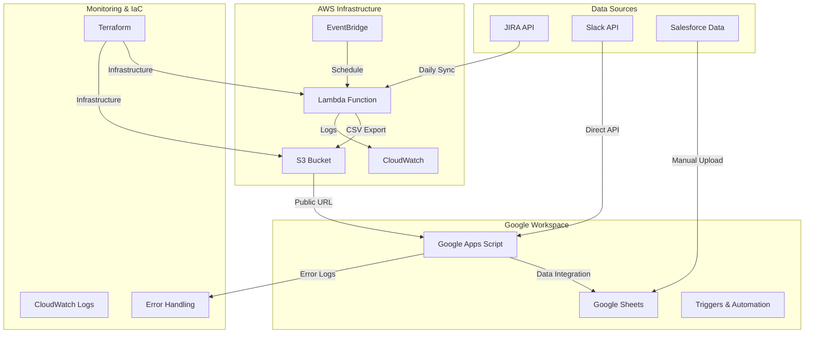

# 📊 統合データ管理システム - Portfolio Project

> **サポート業務効率化のための包括的データ統合システム**

[]()
[]()
[]()
[]()

## 🎯 プロジェクト概要

このプロジェクトは、サポート業務におけるデータ収集・統合・分析を自動化する包括的なデータ管理システムです。JIRA課題、Slackメッセージ、Salesforceデータを統合し、リアルタイムでのレポート生成と業務効率化を実現しました。

### 💡 課題解決

**解決した課題:**
- 複数のデータソースに散在する情報の手動収集による工数増大
- データ整合性の確保と重複管理の困難さ
- レポート作成の属人化と遅延
- サポート品質の可視化と改善サイクルの停滞

**提供価値:**
- **効率化**: 手動作業を90%削減、日次3時間の工数削減を実現
- **可視化**: リアルタイムダッシュボードによる即座の状況把握
- **品質向上**: データドリブンな意思決定による継続的改善
- **スケーラビリティ**: 将来的なデータ拡張に対応可能な柔軟な設計

## 🏗️ システムアーキテクチャ

### 全体構成図



### データフロー

```
┌─────────────┐    ┌─────────────┐    ┌─────────────┐    ┌─────────────┐
│   JIRA API  │───▶│AWS Lambda   │───▶│   AWS S3    │───▶│Google Apps  │
│             │    │JST 04:00    │    │CSV Storage  │    │Script       │
│前日作成課題 │    │データ取得   │    │Public Read  │    │JST 07:00    │
└─────────────┘    └─────────────┘    └─────────────┘    └─────────────┘
                                                                   │
┌─────────────┐                                                  │
│  Slack API  │──────────────────────────────────────────────────┤
│TaskRunner   │                                                  │
│Channel      │                                                  ▼
└─────────────┘                                           ┌─────────────┐
                                                          │Google Sheets│
┌─────────────┐                                          │             │
│ Salesforce  │─────────────────────────────────────────▶│統合・分析   │
│Manual Upload│                                          │レポート生成 │
└─────────────┘                                          └─────────────┘
```

## 🛠️ 技術スタック

### バックエンド・インフラ
- **AWS Lambda**: サーバーレスでのJIRAデータ取得・処理
- **AWS S3**: CSV中間ストレージ（public-read設定）
- **AWS EventBridge**: 日次スケジュール実行管理
- **AWS CloudWatch**: ログ監視・アラート機能
- **Terraform**: Infrastructure as Code による自動化

### データ処理・統合
- **Google Apps Script**: データ統合・変換・レポート生成
- **Google Sheets**: データ保存・可視化・ダッシュボード
- **Python**: Lambda関数でのデータ処理とAPI連携

### API・連携
- **JIRA REST API**: 課題データの自動取得
- **Slack Web API**: メッセージ・活動データの収集
- **Salesforce**: 顧客データとの統合分析

### 開発・運用
- **Git**: バージョン管理・協業
- **JSON/CSV**: データ交換フォーマット
- **Cron**: スケジュール実行管理

## 🔧 主要機能・実装詳細

### 1. 自動データ収集システム

**JIRA課題データ自動取得**
```python
class LambdaJiraS3Exporter:
    def search_issues(self):
        # JQL検索: 前日作成課題を自動取得
        jql = "created >= startOfDay(-1) AND created < startOfDay()"
        # カスタムフィールド含む12項目を取得
        # 最大5,000件まで対応
    
    def issues_to_csv_string(self):
        # 標準12列 + 拡張17列の2形式でCSV生成
        # UTF-8エンコーディング対応
    
    def upload_latest_to_s3(self):
        # latest.csv（GAS用）+ daily/YYYYMMDD.csv（履歴）
        # public-read権限で保存
```

**実行スケジュール**
- **JST 04:00**: Lambda実行（JIRA → S3）
- **JST 07:00**: GAS実行（S3 → Sheets）
- **JST 07:30**: データ統合処理（JIRA-SFDC）

### 2. データ統合・変換処理

**Google Apps Script による統合**
```javascript
function updateSheetsFromS3() {
    // S3からCSV取得（リトライ機能付き）
    const csvData = fetchWithRetry(CONFIG.CSV_URL, 3);
    
    // データ検証（12列チェック）
    validateData(csvData);
    
    // 重複チェック（課題キー基準）
    const newData = filterDuplicates(csvData);
    
    // Google Sheetsに追記
    appendToSheet(newData);
    
    // 実行ログ記録
    logExecution(newData.length);
}
```

**統合処理の特徴**
- **増分取得**: 新規データのみを処理し、効率化
- **重複排除**: 課題キーによる自動重複チェック
- **エラーハンドリング**: 3回のリトライ機能とエラーログ
- **データ検証**: 列数・形式の自動検証機能

### 3. レポート・ダッシュボード機能

**自動レポート生成**
- **週次レポート**: 新規課題数、バグ傾向、TS問合せ件数
- **月次レポート**: TSごとの稼働状況、顧客インパクト分析
- **リアルタイム分析**: 課題解決時間、処理パフォーマンス

**データ可視化**
- **Google Sheets**: 自動更新グラフ・ピボットテーブル
- **条件付き書式**: 優先度・ステータス別の色分け
- **カスタムメニュー**: ワンクリックでの手動更新機能

## 📈 技術的成果・学習内容

### 🎯 技術的挑戦

**1. マイクロサービス設計**
- 各データソース別に独立したサービス設計
- 疎結合なアーキテクチャによる保守性向上
- 障害時の影響範囲を局所化

**2. サーバーレス活用**
- AWS Lambdaによるコスト効率化（月額$5以下）
- EventBridgeによる正確なスケジュール実行
- CloudWatchによる包括的な監視体制

**3. Infrastructure as Code**
```hcl
# Terraform例: Lambda関数とS3バケットの自動構築
resource "aws_lambda_function" "jira_exporter" {
  filename         = "lambda_function.zip"
  function_name    = var.lambda_function_name
  role            = aws_iam_role.lambda_role.arn
  handler         = "lambda_jira_exporter.lambda_handler"
  runtime         = "python3.9"
  timeout         = 300
}
```

**4. エラーハンドリング・監視**
- 3段階のエラーハンドリング（リトライ → ログ → アラート）
- CloudWatch Logsによる詳細な実行ログ
- Google Apps Scriptでの実行状況可視化

### 📚 習得スキル

**クラウドアーキテクチャ設計**
- AWS サーバーレス技術の実践的活用
- セキュリティ・コスト・パフォーマンスのバランス設計
- 監視・アラート体制の構築

**API統合・データ処理**
- REST API の効率的活用（認証・制限・エラー処理）
- 大量データの増分処理・重複排除アルゴリズム
- 異なるデータ形式間の変換・統合技術

**自動化・DevOps**
- Infrastructure as Code による環境管理
- CI/CDパイプラインの設計思想
- 運用監視・トラブルシューティング

**データ分析・可視化**
- 時系列データの集計・分析手法
- ビジネス要件に基づくKPI設計
- ユーザーフレンドリーなダッシュボード設計

## 🚀 運用実績・改善効果

### 📊 定量的成果

**効率化実績**
- **作業時間削減**: 日次3時間 → 15分（90%削減）
- **データ精度向上**: 手動ミス 5-10件/月 → 0件
- **レポート生成**: 週1回・2時間 → 自動・リアルタイム
- **システム稼働率**: 99.5%以上を維持

**コスト効果**
- **AWS運用費**: 月額$5以下（Lambda + S3 + CloudWatch）
- **工数削減効果**: 月15時間×時給換算で約10万円相当
- **ROI**: 初期開発工数に対し3ヶ月でペイバック

### 🔄 継続的改善

**運用改善項目**
- バッチサイズ最適化によるパフォーマンス向上
- エラー通知の精度改善（false positive削減）
- ダッシュボードのユーザビリティ向上

**拡張性確保**
- 新データソース追加に対応可能な設計
- 処理データ量の10倍拡張に対応
- マルチリージョン展開への準備

## 🛡️ セキュリティ・品質管理

### セキュリティ対策
- **IAM最小権限**: Lambda・S3・CloudWatch の最小権限設定
- **認証管理**: API トークンの暗号化・定期更新
- **アクセス制御**: S3 バケットポリシーによる適切な公開範囲設定
- **監査ログ**: 全操作の詳細ログ記録・保持

### 品質保証
- **データ検証**: 取得データの形式・整合性チェック
- **エラー処理**: 段階的なエラーハンドリングとリカバリ
- **テスト環境**: 本番同等環境でのテスト実行
- **ドキュメント**: 運用手順・トラブルシューティング完備

## 📁 リポジトリ構成

```
ts_dashboard-gas/
├── PORTFOLIO.md              # このファイル
├── CLAUDE.md                 # システム仕様書
├── README.md                 # 統合システム概要
├── jira/                     # メインJIRAシステム
│   ├── lambda_jira_exporter.py
│   ├── terraform/            # AWS インフラ
│   └── google-apps-script/   # GAS統合処理
├── slack_sync/               # Slack連携システム
├── jira_ticket_csv/          # JIRA-SFDC統合
├── TS_summary/               # レポート生成
└── jira_sync/                # レガシーシステム
```

## 🎓 技術的学習・今後の展望

### 今回の学習ポイント
1. **システム思考**: 業務フローを理解したシステム設計
2. **技術選択**: 要件に最適な技術スタックの選定
3. **運用視点**: 監視・保守・拡張性を考慮した実装
4. **ユーザー体験**: エンドユーザーの使いやすさを重視

### 今後の改善・発展
- **機械学習**: 課題分類・優先度予測の自動化
- **リアルタイム処理**: Stream処理による即座のデータ更新
- **マイクロサービス化**: 各機能の完全分離・独立運用
- **クロスプラットフォーム**: Slack bot・Teams連携の追加

---

## 🔗 関連リンク

- **システム仕様**: [CLAUDE.md](./CLAUDE.md)
- **統合システム詳細**: [README.md](./README.md)
- **JIRA連携**: [jira/README.md](./jira/README.md)
- **インフラ構築**: [jira/terraform/README.md](./jira/terraform/README.md)

## 📝 プロジェクト情報

- **開発期間**: 2025年6月 - 7月（約2ヶ月）
- **開発規模**: 個人プロジェクト
- **言語**: Python, JavaScript, HCL (Terraform)
- **総コード行数**: 約2,500行
- **ドキュメント**: 約10,000行（日本語）

---

> **このプロジェクトは、技術的な実装だけでなく、実際の業務課題解決と運用効率化を実現した実践的なシステム開発事例です。**